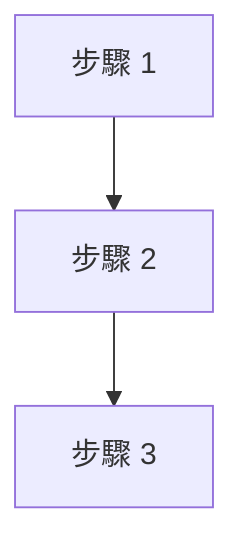

# AI Agent Book 導讀 — 寫作規範

所有章節必須遵守本規範。

---

## 標題規範

### 章節標題

```
# NN — 中文標題（英文 Subject）
```

範例：

```
# 01 — 核心公式：Agent 到底是什麼？
```

### 區塊標題

固定二級標題，順序不可變動：

```
## 這章主要回答什麼問題？
## 英文名詞（附中文）
## 作者真正想表達什麼？
## 白話解釋
## 真實案例
## 常見誤解
## 一句話記住
## 相關工具／GitHub
## 延伸閱讀
## 哪些內容值得學？
## 哪些內容目前可以先跳過？
## 本章重點
## 學完本章後應做到
```

### 三級標題

用於案例分類、迷思分類：

```
### 案例一：案例名稱（領域）

### ❌ 迷思一：迷思內容
```

---

## Mermaid 使用規範

- 僅用於解釋關鍵流程（Context 組成、RAG 流程、ReAct 循環）
- 不使用過於複雜的圖表（不超過 10 個節點）
- 圖表需搭配文字說明
- GitHub Flavored Markdown 支援 ```` ```mermaid ````

範例：



---

## 表格格式

### 對比表格

| 欄位 1 | 欄位 2 | 欄位 3 |
|--------|--------|--------|
| 內容   | 內容   | 內容   |

- 使用 `---` 對齊
- 欄位對齊：預設靠左，數字可考慮靠右
- 表格前後需有空行

### 星級表格

| 星級 | 內容 | 原因 |
|------|------|------|
| ★★★★★ | ... | ... |
| ★★★★☆ | ... | ... |
| ★★★☆☆ | ... | ... |

---

## 英文名詞格式

### 第一次出現

```
Agent（智慧代理）
Context（上下文）
```

### 後續出現

直接用英文或中文，不需括號備註。

同一章內，第一次出現時附中文，之後統一用英文或中文。

---

## 星級格式

```
★★★★★  必學
★★★★☆  值得知道
★★★☆☆  先知道即可
★★☆☆☆  可略過（不使用）
★☆☆☆☆  可略過（不使用）
```

---

## 提示框格式

不使用任何特殊提示框語法（如 `:::note` 或 `> **Note**`）。

全部使用標準 Markdown：

| 類型 | 格式 | 範例 |
|------|------|------|
| 重點 | `**` 加粗 | `**這是重點**` |
| 注意 | `**注意：**` | `**注意：** 這裡是注意事項` |
| 最佳實務 | `> **補充說明：**` | `> **補充說明：** 最新作法...` |
| 常見誤解 | `### ❌ 迷思一：` | `### ❌ 迷思一：Agent = ChatGPT` |

---

## 案例格式

每章至少三個真實案例。

案例領域盡量多元，從以下挑選：

```
生活、企業、AI、軟體開發、金融、教育、醫療、工廠、物流
```

案例結構：

```
### 案例一：簡短名稱（領域）

一段情境描述。

1. 步驟一
2. 步驟二
3. 步驟三

結論或要點。
```

---

## Markdown 規範

### 換行

- 段落之間空一行
- 列表項目之間不空行
- 表格前後空一行

### 程式碼區塊

- 行內程式碼使用反引號：\``code`\`
- 多行程式碼使用三個反引號：\`\`\`code\`\`\`

### 檔案路徑

- 使用相對路徑：`[文字](檔案路徑)`
- 交叉連結使用 `../` 上升到上層目錄

### 清單

- 無序清單使用 `-`（不使用 `*`）
- 有序清單使用 `1.` `2.` `3.`

### 強調

- 重要概念使用 `**加粗**`
- 英文專有名詞首字母大寫：Agent、Context、LLM、RAG
- 不使用底線 `_` 或刪除線 `~~`

---

## 每章長度規範

| 項目 | 標準 |
|------|------|
| 總字數 | 2000-4000 字 |
| 案例數 | 至少 3 個 |
| 本章重點 | 5-10 點 |
| 學完後應做到 | 4-8 項 |
| 英文名詞 | 8-15 個 |

---

## glossary 引用規範

glossary 中的條目應使用相對路徑連結：

```
[Agent](../glossary/Agent.md)
```

每章第一次出現的關鍵名詞，應連結到對應的 glossary 條目。

---

## 版本管理

每次改版需更新：

1. `CHANGELOG.md` — 記錄改版內容
2. `review/` — 記錄 Review 意見與修改
