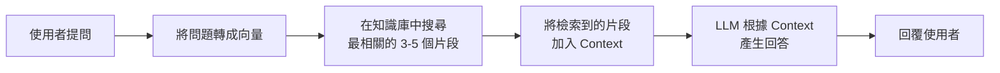

# 03 — 記憶與知識庫——讓 Agent 記得住

## 這章主要回答什麼問題？

為什麼每次跟 ChatGPT 開始新對話，它都像失憶一樣？

怎麼讓 Agent 記住你喜歡靠窗座位、不吃牛肉？

怎麼讓 Agent 查閱公司的退款政策來回答問題？

記憶（Memory）、知識庫（Knowledge Base）、RAG 這三個東西到底是什麼關係？

## 英文名詞（附中文）

| 英文 | 中文 | 一句話解釋 |
|------|------|-----------|
| Memory | 記憶 | 跨會話保留的使用者個人化資訊 |
| Knowledge Base | 知識庫 | 所有使用者共享的集體知識（文件、政策、規範） |
| RAG (Retrieval-Augmented Generation) | 檢索增強生成 | 從知識庫找出相關片段，當作上下文送給 LLM 的技術 |
| Embedding | 嵌入向量 | 把文字轉成數學向量，讓機器能比對「意思相近」的內容 |
| Vector Search | 向量搜尋 | 在向量空間中找到最相似內容的搜尋方式 |
| Semantic Search | 語意搜尋 | 根據意思而非關鍵字來搜尋 |
| Chunking | 文件分塊 | 把長文件切成小段，方便檢索 |

## 作者真正想表達什麼？

要理解這章，我們先回答一個根本問題：**LLM 有哪些天生的能力限制？**

### 限制一：LLM 只記得「訓練時看過的東西」

一個 LLM 在 2024 年訓練完成，它就不知道 2025 年的新政策。你問它「我們公司最新的退貨規則是什麼？」，它只能亂猜——因為它沒看過你們公司的內部文件。

### 限制二：Prompt 只能暫時告訴它，對話結束就忘了

你可以用 System Prompt 告訴 Agent「我們的退貨規則是 15 天」。但這個資訊只存在於當前對話——下一段對話又得重新講一次。而且 Prompt 越長，成本越高、效果越差。

### 限制三：光靠「訓練資料 + Prompt」還是不夠

```
你現在面對的狀況：
  LLM 訓練資料：停在 2024 年
  Prompt 長度：有限（而且越長越貴）
  你的公司政策：每季更新
  你的個人偏好：每次對話不同

所以你需要：
  ① 一個地方存「公司的知識」（政策、規範、產品資料）
     → 這叫 知識庫（Knowledge Base）
  ② 一個地方存「你個人的資訊」（偏好、習慣、歷史）
     → 這叫 使用者記憶（User Memory）
  ③ 一個技術讓 Agent 在需要時「找出相關知識」
     → 這叫 RAG（檢索增強生成）
```

### 為什麼這三個缺一不可？

```
你可以把 Agent 想像成一個新人助理：

第一天上班：
  你給他一本員工手冊（知識庫）。
  他需要的時候會翻（RAG）。
  他記住你喜歡美式咖啡（記憶）。

如果沒有知識庫：
  助理只能靠自己的常識回答——他不知道公司的特殊規定。

如果沒有 RAG：
  助理得把 300 頁手冊全部背下來才能回答——太慢也太貴。

如果沒有記憶：
  助理每天都要重新問你叫什麼名字。
```

**這就是作者想表達的核心：LLM 很聰明，但它有自己的能力邊界。記憶、知識庫和 RAG，就是在補齊這些邊界。**

## 白話解釋

### 先從人的大腦開始理解

在講技術之前，先用「人的記憶系統」來理解這三個概念：

```
人的大腦                → AI 的對應
────────────────────────────────
長期記憶（你記得的事）   → Memory（使用者的個人資訊）
                      
書櫃（你查的書）        → Knowledge Base（共用的知識庫）
                      
去圖書館查資料           → RAG（從知識庫中找出相關段落）
```

**人的長期記憶** = Agent 的 Memory。
你記得朋友喜歡喝什麼、討厭什麼——這是針對個人的人際記憶。Agent 也一樣：它記住你偏好靠窗座位、不吃牛肉。

**書櫃裡的書** = Knowledge Base。
書是寫給所有人看的，不是只給你一個人看。公司的退款政策、產品規格——這是所有人都能查的知識。

**去圖書館查資料的動作** = RAG。
你不會把整座圖書館的書背下來。你需要的時候，去查目錄、找到書、翻到相關章節、讀完放回去。RAG 就是這個動作。

### Memory vs Knowledge Base：最關鍵的差別

| | 使用者記憶（Memory） | 知識庫（Knowledge Base） |
|---|---|---|
| **對象** | 針對單一使用者 | 所有使用者共享 |
| **內容** | 偏好、習慣、個人資料 | 政策、規範、產品知識 |
| **誰來填寫** | Agent 自己觀察和記錄 | 公司文件、官方資料 |
| **更新頻率** | 每次互動即時更新 | 需要管理員定期更新 |
| **儲存方式** | 通常用簡單的 JSON 或結構化資料 | 向量資料庫或文件系統 |

**生活比喻：**

想像你去一間你很熟的咖啡店。

- **記憶**：老闆記得你 usual order——冰拿鐵、少冰、不加糖。你不需要每次重複說。
- **知識庫**：櫃檯上有一張今日甜點清單。今天的 cheesecake 是藍莓口味。老闆翻一下就知道。
- **RAG**：是老闆「翻清單」的動作。他不會把整本菜單背下來，而是需要時才看。

### RAG 到底是什麼？完整流程

RAG 的全名是 Retrieval-Augmented Generation（檢索增強生成）。口語說就是：**先查資料，再回答問題。**

步驟如下：



**生活案例：**

你在考試，題目是「台灣 2024 年 GDP 成長率是多少？」

如果你把整本經濟年鑑背下來（把整個知識庫塞進 Context），太累了。

如果你知道去翻第 37 頁（RAG：搜尋相關片段），找到那一段，讀完後回答——這就是 RAG。

**RAG 不是知識庫本身，而是「從知識庫找東西的技術」。**

這句話非常重要，因為這是初學者最常搞混的地方。

### Memory / Knowledge Base / RAG 三方對照

為了徹底釐清三者的關係，這裡用同一組場景來對比：

| 場景 | Memory | Knowledge Base | RAG |
|------|--------|----------------|-----|
| **這是什麼？** | 你的個人筆記本 | 公司的共用文件櫃 | 你翻文件櫃的動作 |
| **裡面有什麼？** | 「你」的資訊 | 「大家」的資訊 | 不儲存東西，只是過程 |
| **誰能用？** | 只有你 | 所有人 | 所有人（但每次找的結果不同） |
| **跟 Context 的關係** | 需要時載入 Context | 需要時透過 RAG 載入 Context | 決定哪些 KB 內容進 Context |
| **生活類比** | 助理記住你喜歡什麼 | 公司的 SOP 手冊 | 助理去翻 SOP 找答案的動作 |
| **沒有它會怎樣** | Agent 不認識你 | Agent 只知道常識 | Agent 找錯或找不到答案 |

### 那 Embedding 又是什麼？

Embedding 是把文字轉成數學向量的技術。它的核心邏輯是：**意思相近的文字，向量距離也近。**

```
「如何退貨」→ [0.2, -0.5, 0.8, 0.1, ...]
「退款流程」→ [0.3, -0.4, 0.7, 0.2, ...]  ← 相近
「東京天氣」→ [0.9, 0.1, -0.3, 0.8, ...]  ← 很遠
```

所以當使用者問「可以退貨嗎？」，向量搜尋會找到「退款流程」、「退貨政策」等相關片段，而不只是找到有「退貨」兩個字的段落。

## 真實案例

### 案例一：跨會話記憶（生活）

你上週跟客服 Agent 說：「我是會員編號 12345 的使用者。」

這週你回來：「幫我查我上次買的耳機還在保固內嗎？」

- **沒有記憶的 Agent**：請先提供您的會員編號。請問您上次購買的是什麼產品？
- **有記憶的 Agent**：好的，我查到了。您的會員編號 12345，上次購買的耳機是 3 月 15 日訂購的，仍在保固期內。

### 案例二：企業知識庫（商業）

一間大型電信公司每天有上千通客服電話。

客服 Agent 需要查閱：
- 費率方案說明（數十種方案）
- 合約規範（PDF 文件）
- 促銷活動資訊（每週更新）
- 常見問題（FAQ）

這些資料全部存在知識庫中。Agent 每次接到問題，用 RAG 找到相關段落，再回答客戶。

如果沒有知識庫：Agent 只能用模型訓練時的資料回答，不知道最新促銷方案。

### 案例三：Deep Research 使用搜尋（AI）

你問：「2026 年 Q1 全球電動車銷售排名。」

Deep Research Agent 會：

1. 搜尋網路（工具）
2. 找到各市調公司的報告（知識庫）
3. 讀取報告中的關鍵數據（RAG：從報告中找出銷售數字）
4. 整理成表格回覆

這裡的「知識庫」是整個網路，「RAG」是搜尋引擎 + 讀取頁面的能力。

### 案例四：醫院病歷摘要（醫療）

醫生對 Agent 說：「幫我摘要這位病人過去三個月的回診記錄。」

Agent 需要從病歷系統（知識庫）中找出：

- 三次回診的記錄
- 每次的診斷與用藥
- 檢驗報告數據

但病人的過敏記錄（記憶）也需要一併考量——「對 penicillin 過敏」是永久的個人資訊。

**這裡清楚展示了記憶和知識庫的分工：** 病人的過敏史是記憶（個人化），檢驗報告是知識庫（結構化資料），兩者透過 Context 合併後回答醫生。

## 常見誤解

### ❌ 迷思一：Memory = Knowledge Base

| | 記憶 | 知識庫 |
|---|---|---|
| 對象 | 你一個人 | 所有人 |
| 內容 | 「你喜歡什麼」 | 「世界長怎樣」 |
| 錯誤後果 | 推薦你不喜歡的東西 | 回答錯誤的事實 |

### ❌ 迷思二：RAG = Knowledge Base

RAG 是**技術**，知識庫是**儲存**。

就像「煮飯」跟「米」的差別。RAG 是煮飯的流程，知識庫是米。

| | 知識庫 | RAG |
|---|---|---|
| 它是什麼 | 存放資料的地方 | 從資料中找東西的技術 |
| 類比 | 書櫃 | 翻書的動作 |
| 沒有它會怎樣 | Agent 沒有資料可用 | 有資料但 Agent 找不到 |

### ❌ 迷思三：Context 越長，RAG 就不需要了

不對。即使 Context 可以無限長，把整份知識庫塞進去仍然很糟：

- 模型會忽略中間的關鍵資訊（Lost in the Middle 效應）
- 成本與 Context 長度成正比
- 延遲大幅增加

RAG 的核心價值不是「放不下」，而是「只放需要的」。

### ❌ 迷思四：向量搜尋完全取代關鍵字搜尋

向量搜尋擅長語意相似（「如何退款」≈「退貨流程」），但不擅長精確匹配（「訂單編號 #12345」）。最好的做法是兩者混合。

## 一句話記住

> **記憶記住你是誰，知識庫知道世界長怎樣，RAG 是把它們餵給 Agent 的技術。**

三者缺一不可：沒有記憶，Agent 每次都是陌生人；沒有知識庫，Agent 只能靠過時的訓練資料；沒有 RAG，有知識也用不上。

## 相關工具／GitHub

| 星級 | 工具 | 說明 |
|------|------|------|
| ★★★★★ | [OpenAI Embeddings API](https://platform.openai.com/docs/guides/embeddings) | 最常用的 Embedding 服務，把文字轉成向量 |
| ★★★★★ | [LlamaIndex](https://github.com/run-llama/llama_index) | RAG 框架，示範了完整的檢索→增強→生成流程 |
| ★★★★☆ | [LangChain RAG](https://github.com/langchain-ai/langchain) | 另一個主流 RAG 框架，提供了多種檢索策略 |
| ★★★★☆ | [Mem0](https://github.com/mem0ai/mem0) | 專注於使用者記憶的開源專案 |
| ★★★☆☆ | [Chroma](https://github.com/chroma-core/chroma) | 輕量級向量資料庫，適合入門學習 RAG |

## 延伸閱讀

- **原書第三章**：更深入的 Embedding 技術細節
- **[OpenAI RAG Guide](https://platform.openai.com/docs/guides/rag)**：RAG 的最佳實務
- **[Anthropic Contextual Retrieval](https://www.anthropic.com/news/contextual-retrieval)**：Anthropic 提出的上下文感知檢索方法

> **【業界補充】** Anthropic 在 2025 年提出的 Contextual Retrieval 是對傳統 RAG 的重要改進。傳統 RAG 只對文件片段做向量化，Contextual Retrieval 在每個片段前加上一段「這段話的上下文說明」，顯著提升檢索準確率。如果你正在實作 RAG，建議直接參考 Anthropic 的做法。

## 哪些內容值得學？

| 星級 | 內容 | 原因 |
|------|------|------|
| ★★★★★ | Memory vs Knowledge Base 的差別 | 最核心的分類觀念 |
| ★★★★★ | RAG 完整流程：檢索→增強→生成 | Agent 使用知識的標準方式 |
| ★★★★★ | 向量搜尋 vs 關鍵字搜尋各擅長什麼 | 實作 RAG 的基礎知識 |
| ★★★★ | 記憶的三層能力：回憶、關聯、主動 | 評估記憶系統好壞的框架 |
| ★★★★ | Embedding 的基本概念 | 理解向量搜尋的原理 |
| ★★★ | Chunking 策略 | 進階 RAG 調校技巧 |
| ★★★ | Contextual Retrieval | 目前最先進的檢索方法 |

## 哪些內容目前可以先跳過？

- **ANN 索引演算法的詳細對比**（HNSW vs ANNOY）：知道有「近似最近鄰搜尋」就好
- **稠密嵌入 vs 稀疏嵌入的數學公式**：知道稠密擅長語意、稀疏擅長關鍵字就夠
- **GraphRAG 和 RAPTOR 的實作細節**：進階索引方法，用到再學
- **User as Code 等前沿記憶研究**：非常早期，還不成熟

## 本章重點

1. **記憶是個人化的，知識庫是共享的**——這是最根本的分類

2. **沒有記憶**：Agent 每次跟你說話都像第一次見面

3. **沒有知識庫**：Agent 只能回答模型訓練時學到的知識，不知道最新資訊

4. **RAG = 檢索 → 增強 → 生成**

   ```
   第一步：把使用者的問題轉成向量
   第二步：在知識庫中找到最相關的 3-5 個片段
   第三步：把這些片段當作 Context 送給 LLM
   第四步：LLM 根據 Context 產生回答
   ```

5. **RAG 不是知識庫**——RAG 是技術，知識庫是儲存

6. **向量搜尋擅長語意**（「如何退款」≈「退貨流程」），**關鍵字搜尋擅長精確匹配**（訂單編號）

7. **Embedding 翻譯「意思相近 → 距離相近」**，讓機器能理解語意

8. **文件需要先切成片段（Chunking）**，不能整本丟進去

9. **記憶需要定期整理（睡眠整合）**，否則會退化成資訊堆積

10. **Contextual Retrieval 是目前最先進的 RAG 方法**，建議直接採用

## 學完本章後應做到

- ✓ 能分辨記憶和知識庫的差別
- ✓ 能說出 RAG 的四個步驟
- ✓ 知道向量搜尋和關鍵字搜尋各擅長什麼
- ✓ 理解「RAG 不是知識庫」
- ✓ 知道為什麼不能把整份文件塞進 Context
- ✓ 能舉例說明生活中哪些是記憶、哪些是知識庫

---

[上一章：上下文（Context）——Agent 能力的天花板](02-上下文決定一切.md)

[下一章：工具——Agent 的手腳](04-工具.md)
