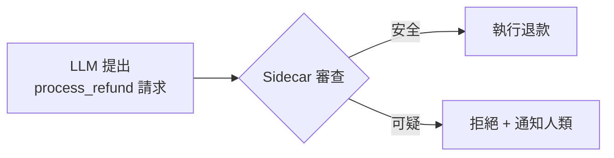

# 04 — 工具——Agent 的手腳

## 這章主要回答什麼問題？

LLM 只能思考，不能做事——那它要怎麼真正改變世界？

工具（Tool）跟工具呼叫（Tool Calling）有什麼不同？

什麼是 MCP？為什麼大家都在講它？

Agent 到底是怎麼「使用」工具的？

## 英文名詞（附中文）

| 英文 | 中文 | 一句話解釋 |
|------|------|-----------|
| Tool | 工具 | Agent 能呼叫的外部功能（搜尋、寫檔、執行程式碼） |
| Tool Calling | 工具呼叫 | LLM 決定「我要用哪個工具」並產生呼叫請求的過程 |
| Function Calling | 函式呼叫 | 跟 Tool Calling 幾乎相同，OpenAI 的用語 |
| MCP (Model Context Protocol) | 模型上下文協定 | 統一工具與資料源的通訊標準 |
| ACI (Agent-Computer Interface) | Agent-電腦介面 | 讓 Agent 而非人類能順暢使用的工具設計原則 |
| Sandbox | 沙盒 | 安全的隔離執行環境，防止 Agent 做壞事 |
| HITL (Human-In-The-Loop) | 人在迴路 | 敏感操作需人類確認才執行 |
| Sidecar | 邊車機制 | 獨立的輕量模型在背景審查每次工具呼叫 |
| Proposer-Reviewer | 提議者-審核者 | 兩個 Agent 互相制衡：一個提議、一個審查 |

## 作者真正想表達什麼？

第一章的核心公式是：Agent = LLM + Context + Tools。

前兩章講了 LLM 和 Context。這一章講 **Tools**。

### 先搞清楚一件事

> **Tool Calling 不是讓 AI 變得更聰明，而是讓 AI 擁有真正的手腳。**

這是最重要的一句話。

我們在前三章花了大量力氣讓 AI 變聰明：更好的 Context、更多的記憶、更完整的知識。

但聰明有什麼用？如果你能推理出「這筆訂單需要退款」，卻沒辦法真的按下退款按鈕——那你還是只能給建議，不能解決問題。

工具不做這件事：**讓 AI 從「顧問」變成「執行者」**。

### 作者真正想解決的問題

> **LLM 只能想，不能做。**

你跟 ChatGPT 說「幫我發一封郵件給老闆請假」，它只能幫你擬稿。你還是得自己複製、貼上、打開 Gmail、點發送。

但如果 ChatGPT 可以幫你打開 Gmail、填寫收件人、輸入內容、點發送——**它就是 Agent 了**。這個差別，就在於有沒有工具。

### 為什麼需要工具？

```
沒有工具的 AI：
  使用者：「幫我查一下今天的股價。」
  AI：「好的，今天的台積電股價是 XXX。」
  但它是用訓練資料回答的。如果是問今天的股價，它不知道。

有工具的 AI：
  使用者：「幫我查一下今天的股價。」
  AI → 呼叫「股價查詢 API」工具 → 取得即時資料 → 回答
  AI 不是「記得」股價，而是「查到了」股價。
```

工具讓 LLM 從「知道很多」變成「能做很多」。

### 作者對工具的核心觀點

作者把工具分成五類。這五類的區分比你想像的重要：

```
感知工具 → Agent 用來獲取資訊（搜尋、讀檔、查 API）
執行工具 → Agent 用來改變世界（寫檔、發郵件、扣款）
協作工具 → Agent 用來驅動其他 Agent
事件觸發 → 外部事件驅動 Agent（收到新郵件、定時任務）
使用者溝通 → Agent 跟使用者對話
```

**最需要小心設計的是執行工具。** 因為錯誤的代價可能極高——誤刪檔案、發錯郵件、扣錯款項。

## 白話解釋

### Tool / Tool Calling / Function Calling 到底是什麼？

這是初學者最容易搞混的一組名詞。先看一張對照表：

| 名詞 | 它是什麼 | 類比 |
|------|----------|------|
| Tool（工具） | 一個可呼叫的功能，有名字、參數、回傳值 | 遙控器上的按鈕 |
| Tool Calling（工具呼叫） | LLM 決定「我要按哪個按鈕」的過程 | 你決定按「音量+」 |
| Function Calling（函式呼叫） | 跟 Tool Calling 幾乎一樣，OpenAI 的用語 | 跟上面一樣，只是命名不同 |

**實際流程是這樣的：**

```
使用者問：「幫我查台北天氣。」

第一步：系統告訴 LLM 有哪些工具可用
  → 工具清單中有「get_weather(city: string)」

第二步：LLM 自己決定要使用這個工具
  → LLM 回傳：「我要呼叫 get_weather，參數 city = '台北'」

第三步：Agent 框架執行這個工具
  → 實際去呼叫天氣 API，拿到「25°C，雨天」

第四步：把結果送回給 LLM
  → 「get_weather 回傳：25°C，雨天」

第五步：LLM 根據結果回答使用者
  → 「台北目前 25°C，正在下雨，建議帶傘。」
```

**關鍵：Tool Calling 不是 LLM 真的去執行程式碼，而是 LLM 回傳一個「我想用這個工具」的請求。**

實際執行是 Agent 框架做的。這個設計是安全考量——LLM 不直接操作系統，只提出請求。

### Tool vs MCP：標準化的重要性

| | 沒有 MCP 的世界 | 有 MCP 的世界 |
|---|---|---|
| 工具格式 | 每家框架自己定義 | 統一標準 |
| 工具遷移 | 換框架要重寫所有工具定義 | 直接沿用 |
| 生態 | 工具只能在單一框架內使用 | 工具可跨框架使用 |
| 類比 | 每家手機用不同充電頭 | USB-C 統一標準 |

MCP 就像 AI 界的 USB-C 標準。不管你的 Agent 框架是 OpenAI、Anthropic、LangChain，只要支援 MCP，就能使用同一個工具市場的工具。

**但要注意：MCP 不是 Agent 框架，只是工具的通訊協定。**

| | MCP | Agent Framework |
|---|---|---|
| 負責 | 工具怎麼定義、怎麼呼叫 | Agent 的完整生命週期管理 |
| 類比 | USB 規格書 | 整台電腦 |
| 你能不能只用 MCP？ | 不行，你需要框架來跑 Agent | 可以，框架可選擇是否用 MCP |

### 工具描述為什麼重要？

第二章提過：工具描述要有範例、要說邊界。

為什麼？因為 LLM 是一個只看得懂文字的系統。它沒有直覺——如果你不告訴它參數格式，它就亂猜。

```
不好的描述：
  date：請輸入日期。

好的描述：
  date：查詢的日期，格式 YYYY-MM-DD。
  範例：2024-03-15
  不能接受：「明天」、「下週一」等相對日期。
  如果使用者給的是相對日期，請先換算成絕對日期再傳入。
```

**工具是寫給 LLM 看的，不是寫給人看的。** 這是最重要的設計原則。

## 真實案例

### 案例一：搜尋引擎工具（生活）

你問 Agent：「2026 年坎城影展最佳影片是哪部？」

Agent 呼叫搜尋工具：

1. LLM 決定 → 使用 `web_search(query: str)`
2. 框架執行 → Google 搜尋「2026 Cannes Film Festival Best Picture」
3. 搜尋結果送回 LLM
4. LLM 閱讀結果後回答：「是 XXX 獲得最佳影片。」

沒有這個工具：Agent 只能用訓練資料回答，可能過時或錯誤。

### 案例二：客服退款工具（商業）

使用者要求退貨。Agent 需要：

1. 呼叫 `lookup_order(order_id)` → 查到訂單資料
2. 呼叫 `check_refund_policy(order_id)` → 確認可退
3. 呼叫 `process_refund(order_id, amount)` → 執行退款

**但 process_refund 是敏感工具——它會真的扣款。**

這就是為什麼需要安全設計：



Sidecar 是一個獨立的輕量模型，專門檢查工具呼叫的安全性。它只看結構化資料（工具名稱、參數），不看 LLM 的自由文字——防止 LLM 用話術繞過審查。

### 案例三：MCP 工具市場（AI）

一間公司開發了一個「查詢庫存」的 MCP 伺服器。

只要支援 MCP 的 Agent 框架（Cursor、Claude Desktop、OpenClaw 等）都可以直接使用這個工具。工具開發者只需開發一次，到處都能用。

這解決了過去最大的痛點：**每個 Agent 框架都有自己的工具格式，換框架等於重寫工具。**

### 案例四：工廠機台監控（工廠）

工廠的 Agent 需要監控生產線狀態。

工具清單包括：

- `get_machine_status(machine_id)` → 查詢特定機台狀態
- `get_production_line_speed()` → 查詢產線速度
- `alert_maintenance(machine_id, issue)` → 通知維修人員
- `pause_production_line(reason)` → 暫停產線

**alert_maintenance 和 pause_production_line 的差別：**

- alert_maintenance 只是通知，安全等級低
- pause_production_line 會停止生產，必須 HITL（人在迴路）

這就是作者強調的：**執行工具需要分級授權。**

## 常見誤解

### ❌ 迷思一：Tool Calling = 執行程式碼

不對。Tool Calling 是 LLM 說「我想用這個工具」，實際執行是 Agent 框架做的。

| | LLM 做的事 | 框架做的事 |
|---|---|---|
| Tool Calling | 選擇工具、填寫參數 | 執行工具、取回結果 |
| 安全意義 | 只負責提議 | 負責審查、執行、過濾 |

### ❌ 迷思二：MCP = Agent 框架

MCP 只是工具的通訊標準。Agent 框架是完整系統。

| | MCP | Agent Framework |
|---|---|---|
| 範圍 | 工具格式 | 完整生命週期 |
| 包含 | 工具定義、傳輸協定 | Context 管理、記憶、評估、安全 |
| 你能直接跑嗎？ | 不行 | 可以 |

### ❌ 迷思三：工具越多越好

工具越多，模型選擇的負擔越大。超過 100 個工具時，即使最先進的模型也容易選錯。

解決方式：用漸進式披露（第二章有講）。先給目錄，按需載入詳細工具。

### ❌ 迷思四：工具是寫給開發者看的

不對。工具描述是寫給 LLM 看的。人類開發者只是間接使用者。

| 寫給人類看 | 寫給 LLM 看 |
|---|---|
| 「date 參數請填標準格式」 | 「date 格式 YYYY-MM-DD，範例：2024-03-15」 |
| 人類可以自己推斷 | LLM 需要明確範例和邊界 |

## 一句話記住

> **Tool Calling 不是讓 AI 變得更聰明，而是讓 AI 擁有真正的手腳。**

前三章讓 AI 變聰明（Context、Memory、Knowledge Base）。這一章讓 AI 能做事。沒有工具的 LLM 只能給建議，有了工具的 LLM 才能解決問題。

而 MCP 是讓所有 Agent 共用同一套工具的標準。

## 相關工具／GitHub

| 星級 | 工具 | 說明 |
|------|------|------|
| ★★★★★ | [OpenAI Function Calling](https://platform.openai.com/docs/guides/function-calling) | 最主流的 Tool Calling 實作，標準 messages 格式 |
| ★★★★★ | [MCP Specification](https://github.com/modelcontextprotocol/specification) | Anthropic 提出的工具通訊標準，正在快速普及 |
| ★★★★☆ | [LangChain Tools](https://github.com/langchain-ai/langchain) | 提供多種內建工具和工具管理機制 |
| ★★★★☆ | [Claude Code 工具實作](https://github.com/anthropics/claude-code) | 展示了 Sidecar 安全審查的實作方式 |
| ★★★☆☆ | [OpenClaw](https://github.com/anthropics/open-claw) | 開源 Agent，展示了工具定義的漸進式披露 |

## 延伸閱讀

- **原書第四章**：工具設計的深入技術討論
- **[OpenAI Function Calling 文件](https://platform.openai.com/docs/guides/function-calling)**：官方完整的 Tool Calling 指南
- **[Anthropic Tool Use 文件](https://docs.anthropic.com/en/docs/build-with-claude/tool-use)**：Anthropic 的工具使用指南
- **[MCP 官方文件](https://modelcontextprotocol.io)**：MCP 協定的完整規格

> **【業界補充】** 原書出版後，MCP 已成為工具標準化的重要方向。截至 2026 年中，OpenAI Agents SDK、Anthropic Claude Desktop、Cursor、Continue、OpenCode 等主流框架都已支援 MCP。如果你在設計工具系統，建議直接採用 MCP 而非自訂格式。但要注意：MCP 的安全挑戰仍然存在——每個 MCP 伺服器都是潛在的提示注入管道，需要搭配 Sidecar 審查機制。

## 哪些內容值得學？

| 星級 | 內容 | 原因 |
|------|------|------|
| ★★★★★ | Tool Calling 的完整流程（五步驟） | Agent 使用工具的基本原理 |
| ★★★★★ | MCP 的核心概念 | 目前最重要的工具標準化趨勢 |
| ★★★★★ | 工具描述的寫法（範例＋邊界） | 直接影響工具呼叫的成功率 |
| ★★★★ | 工具的五大分類（感知/執行/協作/事件/溝通） | 理解工具的全貌 |
| ★★★★ | Sidecar 安全審查機制 | Agent 安全的重要防線 |
| ★★★★ | 工具 vs MCP 的差別 | 避免概念混淆 |
| ★★★ | ACI 原則 | 進階工具設計思維 |
| ★★★ | HITL（人在迴路） | 高風險操作的保護機制 |

## 哪些內容目前可以先跳過？

- **MCP 傳輸層的技術細節**（stdio vs Streamable HTTP）：知道有兩種傳輸方式就好
- **FastAPI 事件驅動架構的實作細節**：設計 Agent 框架時才需要
- **工具選擇的數學模型**：非常學術，實務上用經驗法則即可
- **ACI 的詳細設計原則**：進階主題，初學者先掌握基本概念

## 本章重點

1. **工具讓 LLM 從「只能想」變成「能做」**——這是 Agent 跟 Chatbot 的本質差別

2. **Tool Calling 的完整流程**：

   ```
   告知工具 → LLM 選擇工具 → 框架執行 → 結果送回 → LLM 回答
   ```

3. **Tool Calling 不是執行程式碼**——LLM 只負責「提議」，框架負責「執行」

4. **工具描述要寫給 LLM 看**——不是寫給人看。要有範例、要說邊界

5. **MCP 是 AI 界的 USB-C 標準**，統一工具定義和呼叫格式

6. **MCP ≠ Agent 框架**——MCP 只管工具通訊，框架管整個生命週期

7. **工具分類：感知、執行、協作、事件觸發、使用者溝通**

8. **執行工具最危險**——需要 Sidecar 審查、HITL、權限分級

9. **工具不是越多越好**——超過 100 個工具，模型容易選錯

10. **Sidecar 機制：獨立模型審查工具呼叫，不看 LLM 的自由文字**

## 學完本章後應做到

- ✓ 能說出 Tool Calling 的完整流程
- ✓ 理解 Tool 跟 Tool Calling 的差別
- ✓ 知道 MCP 是什麼，以及它跟 Agent 框架的不同
- ✓ 能寫出有範例、有邊界的工具描述
- ✓ 知道為什麼需要 Sidecar 審查機制
- ✓ 能舉例說明生活中哪些是 Agent 使用工具的例子
- ✓ 理解為什麼「執行工具」需要最謹慎的設計

---

[上一章：記憶與知識庫——讓 Agent 記得住](03-記憶與知識庫.md)

[下一章：Coding Agent——最強的通用能力](05-Coding-Agent.md)
