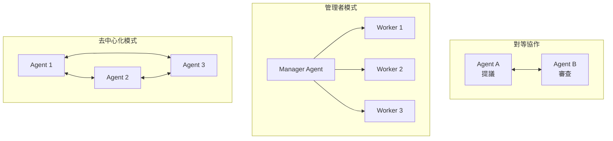

# 07 — 多 Agent 協作——三個臭皮匠

## 這章主要回答什麼問題？

為什麼一個 Agent 不夠？

多個 Agent 要怎麼分工？

多 Agent 一定比單 Agent 好嗎？什麼時候該用、什麼時候不該用？

## 英文名詞（附中文）

| 英文 | 中文 | 一句話解釋 |
|------|------|-----------|
| Multi-Agent | 多代理系統 | 多個 Agent 協同完成任務 |
| Orchestration | 管理者模式 | 一個 Manager Agent 拆任務、分配、整合 |
| Peer Collaboration | 對等協作 | 多個地位平等的 Agent 互相審查迭代 |
| Handoff | 移交 | 一個 Agent 將任務轉交給另一個 Agent |
| Shared Context | 共享上下文 | 多個 Agent 共用同一份對話歷史 |
| Proposer-Reviewer | 提議者-審核者 | 一個負責提方案，一個負責審查 |

## 作者真正想表達什麼？

### 概念誕生故事：為什麼一個 Agent 不夠？

先想想人類的團隊是怎麼工作的。

```
一個人做一個專案：
  你同時是：
  - PM（規劃要做什麼）
  - 工程師（實際動手做）
  - QA（測試有沒有問題）
  - 設計師（決定長什麼樣子）

你會遇到什麼問題？
  ① 你無法同時專注在所有角色上
  ② 你自己寫的 code 自己 review——看不出 bug
  ③ 你累了就沒人接手
  ④ 每個角色需要不同的知識和工具
```

**Agent 也一樣。**

一個通用的 Agent 什麼都能做，但什麼都做得不夠專精。而且它會遇到跟人類一樣的問題：**自己做的事自己檢查不出錯誤。**

這就是多 Agent 協作出現的原因——不是因為多個 Agent 比較酷，而是因為某些情況下，**多個 Agent 分工比一個萬能 Agent 更安全、更可靠。**

### 多 Agent 何時真的比單 Agent 好？

這是本章最關鍵的問題。答案是：**只有當協作過程引入了單個 Agent 無法獲得的新資訊時，多 Agent 才有價值。**

```
有效的情境：
  Reviewer Agent 看到了「測試執行結果」
  → 這項資訊是 Proposer 產生程式碼時沒有的
  → Reviewer 可以根據測試結果給出具體建議

無效的情境：
  讓同一個模型重新閱讀自己的輸出
  → 沒有新資訊
  → 只是花更多錢得到一樣的答案
```

### 三種協作模式



| 模式 | 適合 | 控制方式 | 複雜度 |
|------|------|---------|--------|
| 對等協作 | 2-3 個 Agent 互相審查 | 無中心控制 | 低 |
| 管理者模式 | 任務可拆成獨立子任務 | 中心化控制 | 中 |
| 去中心化模式 | 大量 Agent 自主協作 | 無中心控制 | 高（目前仍在實驗階段） |

## 白話解釋

### 提議者-審核者：最實用的多人協作模式

在所有多 Agent 模式中，目前最成熟、最實用的是 Proposer-Reviewer（提議者-審核者）。

```
Proposer（提議者）：
  → 負責產生方案
  → 需要創造力、執行力
  → 範例：寫程式碼

Reviewer（審核者）：
  → 負責檢查方案
  → 需要批判力、細節敏感度
  → 範例：執行程式碼、檢查 bug
```

為什麼這有效？因為**寫 code 跟 review code 需要不同的能力**。一個擅長寫的人不一定擅長抓 bug——就像一個作家不一定擅長校稿。

### 多 Agent 的最大成本

多 Agent 不是免費的。它的代價比你想像的大：

```
單 Agent 完成一個任務：
  → 1 次 LLM 呼叫
  → 1 份 Context 費用

多 Agent 完成一個任務：
  → 假設 3 個 Agent，各迭代 3 次
  → 9 次 LLM 呼叫
  → 而且每個 Agent 都有自己的 Context
  → 總成本約為單 Agent 的 15 倍
```

**所以多 Agent 不是選項——它是一種投資。** 你只有在確認收益大於 15 倍成本時才應該用。

## 真實案例

### 案例一：提議者-審核者寫程式（軟體開發）

Proposer Agent 寫了一段 JavaScript：

```javascript
function calculateTotal(items) {
    return items.reduce((sum, item) => sum + item.price, 0);
}
```

Reviewer Agent 執行後發現：`item.price` 可能是字串（從 API 來的），需要轉型別。

Reviewer 回饋：「請確認 price 是數字型別，建議加上 Number() 轉換。」

這就是新資訊的價值：Reviewer 透過「執行測試」得到了 Proposer 沒有的資訊。

### 案例二：客服移交（企業）

使用者打電話來說：「我要取消訂單。」

```
第一線 Agent（客服）：
  查到訂單編號，確認身份
  → 發現金額超過 10 萬，需要主管核准
  → 移交給 Supervisor Agent

Supervisor Agent：
  審查退款原因、確認權限
  → 核准退款
  → 移交回客服 Agent 執行

客服 Agent：
  執行退款
  → 通知使用者
```

這裡的 Handoff（移交）是關鍵設計：每個 Agent 只做自己權限範圍內的事。客服 Agent 沒有退款核准權，必須移交。

### 案例三：書籍翻譯系統（AI）

一本技術書要翻譯成中文。

- **術語表 Agent**：掃描全書，建立統一的術語翻譯對照表
- **翻譯 Agent**：根據術語表，逐章翻譯
- **審校 Agent**：檢查翻譯一致性、術語是否正確

Manager Agent 只維護任務和進度，不存翻譯內容——內容存在檔案系統中。這控制了 Context 的膨脹。

### 案例四：多人並行搜尋（AI）

你問：「誰是 2025 年圖靈獎得主？」

Manager Agent 同時啟動 3 個搜尋 Agent：

- Agent A：搜尋 Google
- Agent B：搜尋 Wikipedia
- Agent C：搜尋 Twitter

一旦其中一個 Agent 找到答案，Manager 立即終止其他 Agent。訊息匯流排負責協調和級聯終止。

## 常見誤解

### ❌ 迷思一：多 Agent 一定比單 Agent 好

不對。多 Agent 的 token 消耗約為單 Agent 的 15 倍。如果一個調校好的單 Agent 就能解決問題，不要用多 Agent。

### ❌ 迷思二：多 Agent = 同時用多個模型

不完全是。多 Agent 的核心是分工協作——不同的角色、不同的上下文、不同的權限。用同一個模型的多個實例也可以。

### ❌ 迷思三：Agent 之間能互相審查出所有錯誤

只有當審查引入了新資訊時才有效。讓同一個模型看一樣的文字再審查一遍——沒用。

### ❌ 迷思四：多 Agent 不需要設計溝通機制

不對。多 Agent 最大的工程挑戰不是 AI 能力，而是溝通設計：Context 要不要共享？誰來決定誰做什麼？錯誤誰負責？

## 一句話記住

> **多 Agent 的關鍵不是「多」，而是「新資訊」。如果協作過程沒有引入新資訊，用多 Agent 只是浪費錢。**

## 相關工具／GitHub

| 星級 | 工具 | 說明 |
|------|------|------|
| ★★★★★ | [AutoGen](https://github.com/microsoft/autogen) | 微軟的多 Agent 框架，示範了多種協作模式 |
| ★★★★☆ | [LangGraph](https://github.com/langchain-ai/langgraph) | 支援 Orchestration 和 Peer Collaboration |
| ★★★★☆ | [CrewAI](https://github.com/crewAIInc/crewAI) | 多 Agent 框架，強調角色分工 |
| ★★★☆☆ | [Google ADK](https://github.com/google/adk) | Google 的 Agent 開發套件，含多 Agent 支援 |

## 延伸閱讀

- **原書第十章**：多 Agent 協作的深入討論
- **[Autonomous Agents 調查報告](https://arxiv.org/abs/2501.09669)**：多 Agent 系統的最新研究進展
- **[Anthropic Building Effective Agents](https://docs.anthropic.com/en/docs/build-with-claude/agent)**：Anthropic 對多 Agent 設計的建議

## 哪些內容值得學？

| 星級 | 內容 | 原因 |
|------|------|------|
| ★★★★★ | 多 Agent 何時優於單 Agent 的判據 | 最核心的決策原則 |
| ★★★★★ | 三種協作模式（對等/管理者/去中心化） | 多 Agent 的架構基礎 |
| ★★★★ | Proposer-Reviewer 模式 | 最實用的多 Agent 模式 |
| ★★★★ | Handoff（移交）機制 | 設計多 Agent 流程的關鍵 |
| ★★★★ | 成本意識（15 倍 token） | 避免為了用而用 |
| ★★★ | Shared Context 的取捨 | 進階設計考量 |

## 哪些內容目前可以先跳過？

- **消息佇列的具體實作**（Redis Pub/Sub vs RabbitMQ）：用到再選
- **去中心化模式的詳細討論**：目前仍在實驗階段，實用性有限
- **A2A 協議的標準細節**：知道有這個標準存在就好
- **史丹佛 AI 小鎮的實作細節**：學術研究，不是工程實務

## 本章重點

1. **多 Agent 的關鍵判據**：協作是否引入了單個 Agent 無法獲得的新資訊

2. **沒有新資訊的「自我審查」通常無效**

3. **三種協作模式**：
   - 對等協作（2-3 個 Agent 互相審查）
   - 管理者模式（Manager 拆任務、分配、整合）
   - 去中心化模式（沒有中心控制者）

4. **Proposer-Reviewer 是最實用的模式**：寫 code 跟 review code 需要不同能力

5. **多 Agent 的成本約為單 Agent 的 15 倍**——不要為了用而用

6. **Handoff（移交）**：每個 Agent 只做自己權限範圍內的事

7. **共享 Context vs 不共享 Context**：共享減少溝通成本，但 Context 容易爆

8. **子 Agent 應回傳「結構化摘要」**而非完整軌跡，以控制 Context

9. **多 Agent 最大的工程挑戰是溝通設計**，不是 AI 能力

10. **用多 Agent 之前，先確認一個調校好的單 Agent 無法解決問題**

## 學完本章後應做到

- ✓ 能說出多 Agent 何時優於單 Agent
- ✓ 能說出三種協作模式
- ✓ 理解 Proposer-Reviewer 為什麼有效
- ✓ 知道多 Agent 的成本代價
- ✓ 能分辨「應該用多 Agent」和「不需要用」的場景

## 下一章預告

你現在知道多個 Agent 可以協作。但你有沒有想過：**Agent 能不能自己變強？**

目前為止，所有 Prompt 都是人寫的、所有規則都是人訂的。但如果 Agent 可以從經驗中學習、自己修正自己的行為呢？

下一章要講的就是：Agent 的自我進化。

[上一章：評估——沒有度量就沒有改進](06-評估.md)

[下一章：自我進化（Self Improvement）——越用越聰明](08-自我進化（Self Improvement）.md)
